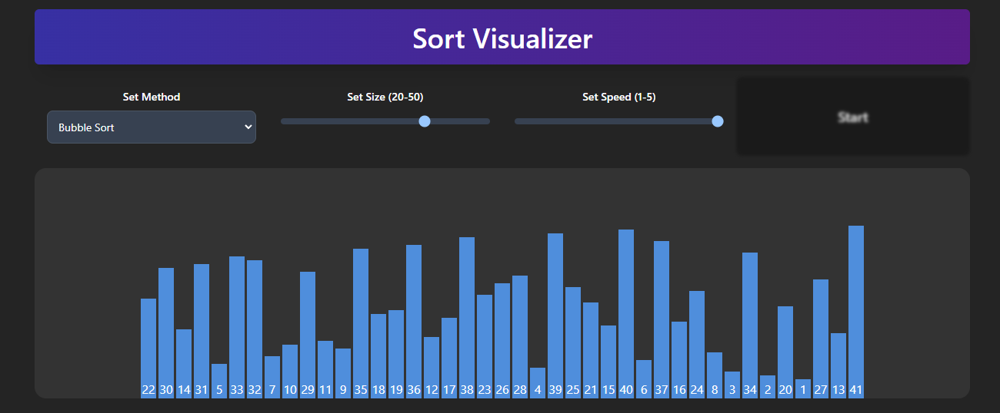

<h1 align="center">Check out the sort visualizer below!</h1>
<h3 align="center">https://sort-visualizer-eight.vercel.app/</h3>

 
  

The sort visaulizer provides cool visualizations for different sorting algorithms. Available methods include fundamental methods such as bubble, selection, insertion, merge, and quick. At the end, statstic for each sorting is provided with the elapsed time and number of comparisons made. Choose a method, set a size and speed, and let the visualization begin!

